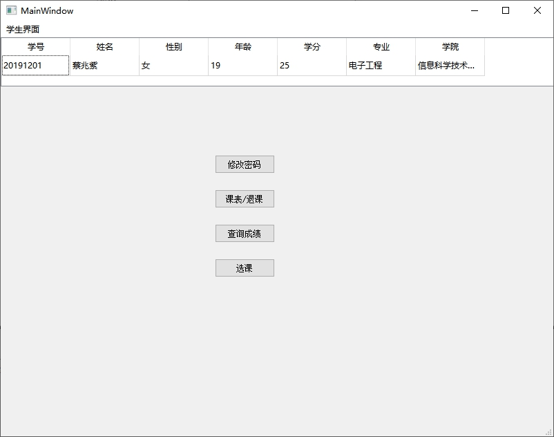

# EduSys

又一个学生成绩管理系统的课程设计

## 1 需求分析

### 1.1 数据需求

对于学生，需要学号，姓名，性别，年龄，学分的数据，每名专业对应一个专业，专业由各个学院开设，学院聘用各位教师。教师教课，学生可以选课。教师有职称，也有工号，姓名，性别，年龄的信息。课程有编号，名称，学分，课程性质。对于每位老师开的课有不同教材。每位学生选的课有对应成绩。

### 1.2 功能需求(处理需求)

#### 1.2.1 教师的功能需求

查询任课信息，给学生赋分，统计学生成绩，显示个人信息，修改密码

#### 1.2.2 学生的功能需求

查询课表，选课，退课，查询成绩，显示个人信息，修改密码

### 1.3 性能需求

1. 安全性需求：给管理员,教师,学生不同的权限,提高数据安全性

2. 完整性需求：创建触发器,存储过程,防止数据不一致

## 2 概念结构设计

全局E-R图如下


## 3 逻辑结构设计

\* 主键用粗体标志，外键用斜体标志

学生（**学号**，姓名，性别，年龄，已修学分，*专业编号*）

课程（**课程编号**，课程名称，学分，课程性质）

教师（**工号**，姓名，性别，年龄，职称，*学院编号*）

专业（**专业编号**，专业名称，*学院编号*）

学院（**学院编号**，学院名称）

选课（***学号，课程编号***，成绩，*任课老师*）

授课（***工号，课程编号***，教室，教材）

账号（**用户名**，密码，身份）

## 4 物理结构设计

### 4.1 聚簇设计

在mysql中，主键默认就是聚簇索引,不需要特别设置。

### 4.2 索引设计

对下面的主键属性列和外键属性列建立索引，不仅有助于唯一性检查和完整性检查，而且可以加快连接查询的速度：

学生（学号，专业编号）

课程（课程编号）

教师（工号，学院编号）

专业（专业编号，学院编号）

学院（学院编号）

选课（学号，课程编号，任课教师）

授课（工号，课程编号）

账号（用户名）

### 4.3 分区设计

磁盘分区设计的本质是确定数据库数据的存放位置，其目的是提高系统性能。磁盘分区设计的一般原则是：

1. 减少访问冲突，提高I/O并行性
2. 分散热点数据，均衡I/O负担
3. 保证关键数据快速访问，缓解系统瓶颈

本成绩管理系统由于数据规模较小，无需进行分区设计。

## 5 数据库的实施，运行与维护

创建基本表的sql语句如下：

```sql
create database Edu;
use Edu;
create table Y(Yid char(10) primary key,Yname char(20));
create table M(Mid char(10) primary key,Mname char(20),Yid char(10),constraint fMY foreign key(Yid) references Y(Yid));
create table S(Sid char(20) primary key,Sname char(20),Ssex char(2),Sage int,credit real,Mid char(10),constraint fSM foreign key(Mid) references M(Mid));
create table C(Cid char(10) primary key,Cname char(20),credit real,Ctype char(100));
create table T(Tid char(20) primary key,Tname char(20),Tsex char(2),Tage int,rank char(20),Yid char(10),constraint fTY foreign key(Yid) references Y(Yid));
create table SC(Sid char(20),Cid char(10),score real,Tid char(20),primary key(Sid,Cid),constraint fSCS foreign key(Sid) references S(Sid),constraint fSCC foreign key(Cid) references C(Cid),constraint fSCT foreign key(Tid) references T(Tid));
create table TC(Tid char(20),Cid char(10),Croom char(20),book char(20),primary key(Tid,Cid),constraint fTCT foreign key(Tid) references T(Tid),constraint fTCC foreign key(Cid) references C(Cid));
create table U(Uid char(20) primary key,pword char(32),grp char(20));
```

建立索引

```sql
create unique index iCCid on C(Cid);
create unique index iSSidMid on S(Sid,Mid);
create unique index iTTidYid on T(Tid,Yid);
create unique index iMMidYid on M(Mid,Yid);
create unique index iYYid on Y(Yid);
create unique index iSCSidCidTid on SC(Sid,Cid,Tid);
create unique index iTCTidCid on TC(Tid,Cid);
create unique index iUUid on U(Uid);
```

设计视图

```sql
-- 学生查询课表
create view kb as select Sid,SC.Cid,Cname,Tname,Croom,book from C,T,SC,TC where SC.Cid = TC.Cid and SC.Tid = TC.Tid and SC.Cid = C.Cid and SC.Tid = T.Tid and score=0;
-- 学生可选课程（请根据Ctype醒目分出必修课，根据Cid在GUI中归类）
create view kxk as select Sid,TC.Cid,Cname,TC.Tid,Tname,Croom,book,Ctype from S,C,T,TC where TC.Tid = T.Tid and TC.Cid = C.Cid and TC.Cid not in(select Cid from SC where SC.Sid=S.Sid);
-- 学生查询成绩
create view ccj as select Sid,Cname,score from C,SC where SC.Cid = C.Cid and score>0;
-- 统计某教师某课的上课人数
create view skrs as select Tid,Cid,count(Sid) rs from SC group by Tid,Cid;
-- 统计某教师某课尚未打分的人数
create view mfrs as select Tid,SC.Cid,Cname,count(Sid) mfrs from SC,C where score = 0 and SC.Cid = C.Cid group by Tid,Cid;
-- 待打分学生的表
create view df as select Tid,SC.Cid,Cname,SC.Sid,Sname,score from SC,C,S where score = 0 and SC.Cid = C.Cid and SC.Sid = S.Sid;
-- 教师查询课表
create view skb as select TC.Tid,TC.Cid,Cname,Croom,book,mfrs from TC,mfrs where TC.Tid = mfrs.Tid and TC.Cid = mfrs.Cid;
-- 统计某教师某课学生平均成绩
create view pjcj as select Tid,Cid,avg(score) pjf from SC group by Tid,Cid;
-- 统计某教师某课的及格人数
create view jgrs as select Tid,Cid,count(*) rsjg from SC where score >= 60 group by Tid,Cid;
-- 统计某教师某课的及格率
create view jgl as select skrs.Tid,skrs.Cid,rsjg*100/rs jgl from skrs,jgrs where skrs.Tid = jgrs.Tid and skrs.Cid = jgrs.Cid;
-- 教师统计课程平均分、及格率
create view jstj as select pjcj.Tid,pjcj.Cid,Cname,pjf,jgl from pjcj,jgl,C where pjcj.Tid = jgl.Tid and pjcj.Cid = jgl.Cid and pjcj.Cid = C.Cid;
-- 学生个人信息
create view xsxx as select Sid,Sname,Ssex,Sage,credit,Mname,Yname from S,M, Y where S.Mid = M.Mid and M.Yid = Y.Yid;
-- 教师个人信息
create view jsxx as select Tid,Tname,Tsex,Tage,rank,Yname from T, Y where T.Yid = Y.Yid;
```

创建触发器

```sql
-- 当删除学生时在SC表中级联删除
create trigger dS
before delete on S
for each row
begin
 delete from SC where SC.Sid = OLD.Sid;
end
;
-- 当删除教师时在TC，SC表中级联删除
create trigger dT
before delete on T
for each row
begin
 delete from TC where TC.Tid = OLD.Tid;
 delete from SC where TC.Tid = OLD.Tid;
end
;
-- 当删除课程时在TC，SC表中级联删除
create trigger dC
before delete on C
for each row
begin
 delete from TC where TC.Cid = OLD.Cid;
 delete from SC where TC.Cid = OLD.Cid;
end
;
-- 教师更新成绩后，如果及格，自动给学生加上学分
create trigger gainCredit
after update on SC
for each row
begin
 if OLD.score < 60 and NEW.score >= 60 then
  update S set credit = credit + (select credit from C where C.Cid = NEW.Cid) where S.Sid = NEW.Sid;
 end if;
end;
```

插入数据

```sql
insert into Y(Yid,Yname) values ('sist','信息科学技术学院');
insert into Y(Yid,Yname) values ('sci','理学院');
insert into M(Mid,Mname,Yid) values ('ee','电子工程','sist');
insert into M(Mid,Mname,Yid) values ('cs','计算机科学与技术','sist');
insert into M(Mid,Mname,Yid) values ('au','自动化','sist');
insert into M(Mid,Mname,Yid) values ('se','软件工程','sist');
insert into M(Mid,Mname,Yid) values ('math','数学','sci');
insert into M(Mid,Mname,Yid) values ('phys','物理','sci');
insert into M(Mid,Mname,Yid) values ('chem','化学','sci');
insert into M(Mid,Mname,Yid) values ('astro','天文','sci');
insert into S(Sid,Sname,Ssex,Sage,credit,Mid) values ('20191101','绍亮','男',20,20.0,'cs');
insert into S(Sid,Sname,Ssex,Sage,credit,Mid) values ('20191102','张妍','女',20,20.0,'cs');
insert into S(Sid,Sname,Ssex,Sage,credit,Mid) values ('20191103','潘家豪','男',19,24.0,'cs');
insert into S(Sid,Sname,Ssex,Sage,credit,Mid) values ('20191201','蔡兆紫','女',19,22.0,'ee');
insert into S(Sid,Sname,Ssex,Sage,credit,Mid) values ('20191202','杜恒辰','男',20,18.0,'ee');
insert into S(Sid,Sname,Ssex,Sage,credit,Mid) values ('20191301','江彥安','男',20,18.0,'au');
insert into S(Sid,Sname,Ssex,Sage,credit,Mid) values ('20191302','齐宜欣','女',20,21.0,'au');
insert into S(Sid,Sname,Ssex,Sage,credit,Mid) values ('20191401','乔梦','女',20,21.0,'se');
insert into S(Sid,Sname,Ssex,Sage,credit,Mid) values ('20191402','李俊盛','男',20,23.0,'se');
insert into S(Sid,Sname,Ssex,Sage,credit,Mid) values ('20192101','萧子轩','男',20,21.0,'math');
insert into S(Sid,Sname,Ssex,Sage,credit,Mid) values ('20192102','甘星宇','男',20,26.0,'math');
insert into S(Sid,Sname,Ssex,Sage,credit,Mid) values ('20192103','陳白和','女',18,22.0,'math');
insert into S(Sid,Sname,Ssex,Sage,credit,Mid) values ('20192201','徐雅晴','女',19,21.0,'phys');
insert into S(Sid,Sname,Ssex,Sage,credit,Mid) values ('20192202','徐建伟','男',20,23.0,'phys');
insert into S(Sid,Sname,Ssex,Sage,credit,Mid) values ('20192301','陳睿駿','男',20,23.0,'chem');
insert into S(Sid,Sname,Ssex,Sage,credit,Mid) values ('20192302','王淑婷','女',20,20.0,'chem');
insert into S(Sid,Sname,Ssex,Sage,credit,Mid) values ('20192401','陳幸明','男',21,20.0,'astro');
insert into S(Sid,Sname,Ssex,Sage,credit,Mid) values ('20192402','邱淑吟','女',20,20.0,'astro');
insert into T(Tid,Tname,Tsex,Tage,rank,Yid) values ('20019101','林雅婷','女',42,'副教授','sist');
insert into T(Tid,Tname,Tsex,Tage,rank,Yid) values ('20019102','张士杰','男',48,'教授','sist');
insert into T(Tid,Tname,Tsex,Tage,rank,Yid) values ('20019103','陳孟中','男',38,'教授','sist');
insert into T(Tid,Tname,Tsex,Tage,rank,Yid) values ('20019104','李月虹','女',51,'教授','sist');
insert into T(Tid,Tname,Tsex,Tage,rank,Yid) values ('20019105','黎靜怡','女',33,'讲师','sist');
insert into T(Tid,Tname,Tsex,Tage,rank,Yid) values ('20019106','陳仁豪','男',43,'讲师','sist');
insert into T(Tid,Tname,Tsex,Tage,rank,Yid) values ('20019107','卢燕','女',39,'讲师','sist');
insert into T(Tid,Tname,Tsex,Tage,rank,Yid) values ('20019108','方斌','男',41,'副教授','sist');
insert into T(Tid,Tname,Tsex,Tage,rank,Yid) values ('20019201','于华清','男',41,'副教授','sci');
insert into T(Tid,Tname,Tsex,Tage,rank,Yid) values ('20019202','闻阳冰','男',43,'副教授','sci');
insert into T(Tid,Tname,Tsex,Tage,rank,Yid) values ('20019203','張明如','女',37,'讲师','sci');
insert into T(Tid,Tname,Tsex,Tage,rank,Yid) values ('20019204','高冰昀','女',44,'讲师','sci');
insert into T(Tid,Tname,Tsex,Tage,rank,Yid) values ('20019205','陳信','男',48,'教授','sci');
insert into T(Tid,Tname,Tsex,Tage,rank,Yid) values ('20019206','丁佩珊','女',46,'教授','sci');
insert into T(Tid,Tname,Tsex,Tage,rank,Yid) values ('20019207','吳武然','男',46,'副教授','sci');
insert into T(Tid,Tname,Tsex,Tage,rank,Yid) values ('20019208','王哲','男',43,'副教授','sci');
insert into C(Cid,Cname,credit,Ctype) values ('0001','英语1',3,'必修:astro chem math phys cs')
insert into C(Cid,Cname,credit,Ctype) values ('0002','英语2',3,'必修:au cs ee se')
insert into C(Cid,Cname,credit,Ctype) values ('0003','电动力学',4,'必修: cs ee phys')
insert into C(Cid,Cname,credit,Ctype) values ('0004','固体物理',4,'必修: cs ee phys')
insert into C(Cid,Cname,credit,Ctype) values ('0005','大学物理',4,'必修: au ee')
insert into C(Cid,Cname,credit,Ctype) values ('0006','微积分',4,'必修: cs se au ee')
insert into C(Cid,Cname,credit,Ctype) values ('0007','概率论',3,'必修: cs se au ee')
insert into C(Cid,Cname,credit,Ctype) values ('0008','离散数学',3,'必修: cs se au')
insert into C(Cid,Cname,credit,Ctype) values ('0009','人工智能导论',3,'必修: cs se au')
insert into C(Cid,Cname,credit,Ctype) values ('0010','计算机网络',3,'必修: cs se au ee')
insert into C(Cid,Cname,credit,Ctype) values ('0011','编译原理',3,'必修: cs se')
insert into C(Cid,Cname,credit,Ctype) values ('0011','编译原理',3,'必修: cs se')
insert into C(Cid,Cname,credit,Ctype) values ('0012','嵌入式系统',3,'必修: cs')
insert into C(Cid,Cname,credit,Ctype) values ('0013','软件工程',4,'必修: se')
insert into C(Cid,Cname,credit,Ctype) values ('0014','自动控制理论',4,'必修: au')
insert into C(Cid,Cname,credit,Ctype) values ('0015','Matlab高级编程',4,'必修: ee')
insert into C(Cid,Cname,credit,Ctype) values ('0016','量子力学',4,'必修: math phys')
insert into C(Cid,Cname,credit,Ctype) values ('0017','高等线性代数',3,'必修: math')
insert into C(Cid,Cname,credit,Ctype) values ('0018','统计力学',3,'必修: phys')
insert into C(Cid,Cname,credit,Ctype) values ('0019','天体物理',3,'必修: astro')
insert into C(Cid,Cname,credit,Ctype) values ('0020','有机合成',3,'必修: chem')
insert into TC(Tid,Cid,Croom,book) values ('20019201','0003','A201','《电动力学导论》')
insert into TC(Tid,Cid,Croom,book) values ('20019201','0004','A203','《固体物理》')
insert into TC(Tid,Cid,Croom,book) values ('20019201','0005','A103','《大学物理学》')
insert into TC(Tid,Cid,Croom,book) values ('20019201','0006','A301','《微积分》')
insert into TC(Tid,Cid,Croom,book) values ('20019202','0003','A204','《电动力学导论》')
insert into TC(Tid,Cid,Croom,book) values ('20019202','0004','A104','《固体物理基础》')
insert into TC(Tid,Cid,Croom,book) values ('20019203','0006','A401','《微积分》')
insert into TC(Tid,Cid,Croom,book) values ('20019203','0007','A201','《概率论基础教程》')
insert into TC(Tid,Cid,Croom,book) values ('20019203','0008','A301','《离散数学》')
insert into TC(Tid,Cid,Croom,book) values ('20019204','0005','A401','《大学物理学》')
insert into TC(Tid,Cid,Croom,book) values ('20019204','0006','A301','《托马斯微积分》')
insert into TC(Tid,Cid,Croom,book) values ('20019204','0007','A301','《概率论基础》')
insert into TC(Tid,Cid,Croom,book) values ('20019204','0008','A101','《离散数学及其应用》')
insert into TC(Tid,Cid,Croom,book) values ('20019101','0009','A301','《人工智能导论》')
insert into TC(Tid,Cid,Croom,book) values ('20019101','0010','A306','《计算机网络》')
insert into TC(Tid,Cid,Croom,book) values ('20019101','0012','A306','《嵌入式系统》')
insert into TC(Tid,Cid,Croom,book) values ('20019101','0011','A201','《编译原理》')
insert into TC(Tid,Cid,Croom,book) values ('20019102','0009','A203','《人工智能导论》')
insert into TC(Tid,Cid,Croom,book) values ('20019102','0010','A303','《计算机网络》')
insert into TC(Tid,Cid,Croom,book) values ('20019102','0011','A303','《编译原理》')
insert into TC(Tid,Cid,Croom,book) values ('20019102','0013','A103','《软件工程》')
insert into TC(Tid,Cid,Croom,book) values ('20019102','0014','A203','《自动控制学》')
insert into TC(Tid,Cid,Croom,book) values ('20019103','0010','A203','《计算机网络》')
insert into TC(Tid,Cid,Croom,book) values ('20019103','0011','A302','《编译原理》')
insert into TC(Tid,Cid,Croom,book) values ('20019103','0015','A402','《MATLAB编程与工程应用》')
insert into SC(Sid,Cid,score,Tid) values ('20191101','0003',82,'20019201')
insert into SC(Sid,Cid,score,Tid) values ('20191101','0004',0,'20019201')
insert into SC(Sid,Cid,score,Tid) values ('20191101','0006',90,'20019201')
insert into SC(Sid,Cid,score,Tid) values ('20191101','0009',0,'20019101')
insert into SC(Sid,Cid,score,Tid) values ('20191101','0010',50,'20019101')
insert into SC(Sid,Cid,score,Tid) values ('20191101','0011',78,'20019101')
insert into SC(Sid,Cid,score,Tid) values ('20191101','0012',86,'20019101')
insert into SC(Sid,Cid,score,Tid) values ('20191102','0003',92,'20019201')
insert into SC(Sid,Cid,score,Tid) values ('20191102','0004',0,'20019201')
insert into SC(Sid,Cid,score,Tid) values ('20191102','0006',94,'20019201')
insert into SC(Sid,Cid,score,Tid) values ('20191102','0009',0,'20019101')
insert into SC(Sid,Cid,score,Tid) values ('20191102','0010',80,'20019101')
insert into SC(Sid,Cid,score,Tid) values ('20191102','0011',88,'20019101')
insert into SC(Sid,Cid,score,Tid) values ('20191102','0012',93,'20019101')
insert into SC(Sid,Cid,score,Tid) values ('20191401','0003',87,'20019201')
insert into SC(Sid,Cid,score,Tid) values ('20191401','0004',0,'20019201')
insert into SC(Sid,Cid,score,Tid) values ('20191401','0006',91,'20019201')
insert into SC(Sid,Cid,score,Tid) values ('20191401','0009',88,'20019101')
insert into SC(Sid,Cid,score,Tid) values ('20191401','0010',82,'20019101')
insert into SC(Sid,Cid,score,Tid) values ('20191401','0011',84,'20019101')
insert into SC(Sid,Cid,score,Tid) values ('20191401','0013',85,'20019102')

```

## 6 程序界面演示

经过考虑取舍，使用 C++/Qt creator 4.15.1(qt 5.15.2) Linux 环境开发。 pacman 安装的 qtcreator 自带数据库驱动，Windows 则需要自行编译。得益于 qt 的跨平台特性，本程序在各平台均可正常编译运行。下面是程序运行在 Windows 平台的截图说明。

打开程序，若连接失败，会弹窗提示。可能是数据库未开启，或数据库的密码错误等原因。点击 Retry 可以重试。

  

若连接成功，进入登录界面。

  

学生/教师使用学号/教工号进行登录。默认密码为学号/教工号，在首次登录失败时会提示。

  

登录成功后，如果是学生身份，界面如下。首行即显示了学生的个人信息。用的是上面写的视图 xsxx。

  

修改密码界面

  

如果之前是默认密码，那么 Uid 中还没有对应条目，新密码会 insert 进 去。此时旧密码只需与用户名相等。否则检查旧密码，然后 update 对应密码。 密码会用 sha256 加密然后加盐 sha256 加密再加用户名 sha256 加密保存，登录时也是加密后比对，基本保证密码不会泄露。

旧密码验证错误无法更新密码：

  

选课界面如下。本专业的必修课会呈现在上面的表，其他在下面。点击每个条目右边的【选课】即可选课，并且刷新可选的课。用的是上面写的视图 kxk 列出可选的课，根据 Ctype 字段归类。点击选课时，根据所在行的 Cid 和 Tid 还有当前用户名，插入到 SC 里。

  

查看课表界面，也可以退课。这里是用上面写的视图 kb。这个课表不包括已经出成绩的课。当点击退课时，在 SC 中 delete 对应条目。

  

查询成绩的界面。使用视图 ccj。

  

教师登录的界面如下。同样，首行是教师的个人信息，视图使用 jsxx

  

修改密码与学生的用的是同一个类，界面功能都是一样的。

教师课表，使用视图 skb。这里的教室，课本是可以编辑的，点击 OK 后 将 update 更新的条目到 TC。

  

教师打分的界面。使用视图 df 得到待打分的表。编辑【分数】后点击 OK，即可 update SC 的 score。

  

成绩统计界面。使用视图 jstj。它依赖 jgl 和 pjcj 等。 如果课程有同学未被打分，将无法统计，并警告如下。

  

全部打分后的一个统计如下

  
